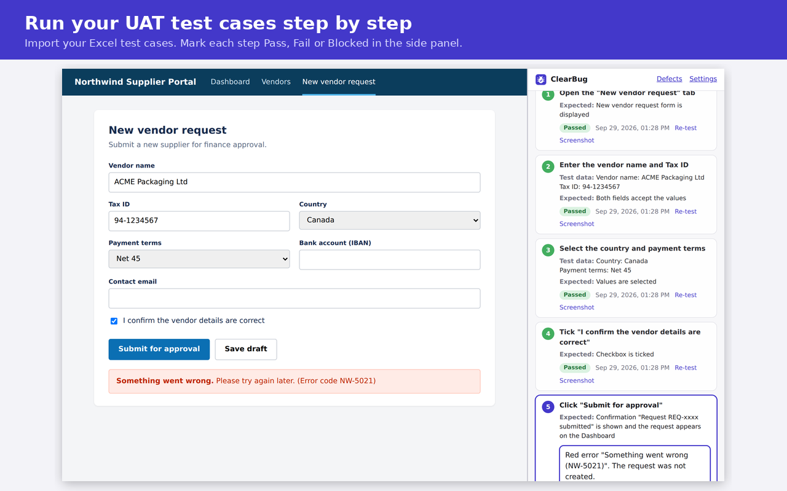

# ClearBug – UAT Test Runner & Bug Reporter

A Chrome extension that helps **business users run UAT test cases** and report failures that developers can act on without follow-up questions.

## Why I built it

While testing web pages, I kept seeing the same thing in the issues users reported: *"it broke when I submitted"*, a cropped screenshot, and no steps. Every report turned into a back-and-forth to find out which page, which data, and what actually happened. On the testing side, I was switching between the system, an Excel file of test cases, and screenshots pasted into a document.

So I built ClearBug to do that bookkeeping while I test: it works from the **Excel test cases the team already uses**, records what happens on the page, and gives back **the same file with results, evidence and linked bug reports filled in**.

## What it does

1. **Import test cases** from .xlsx or .csv. ClearBug finds the header row and matches columns automatically (English and Chinese headers, e.g. "Expected Result" / "预期结果"), handles merged cells and steps written in one cell ("1. … 2. …"). You can fix any column mapping before importing.
2. **Run step by step in the side panel.** The side panel shows the current step, test data and expected result next to the system being tested. Mark each step **Pass / Fail / Blocked**. A screenshot is saved as evidence for every step.
3. **Failed step → bug report.** ClearBug opens a bug report already linked to the test case (TC-001, step 5) with the official steps, the expected result, the tester's note, the screenshot, and the errors it caught on the page.
4. **Catches what testers can't see.** While testing, ClearBug records clicks and typed values as readable steps, plus JavaScript errors and failed API calls (e.g. `POST /api/vendors → 500`).
5. **AI writes the report (optional).** With a Claude API key, Claude reads the note (any language), the steps, errors and screenshot, and writes a structured report: title, severity with reason, steps to reproduce, expected and actual results, plus questions a developer would still ask. Output in English, 简体中文 or 繁體中文. Without a key, a rule-based template is used.
6. **Export to Excel.** One click gives an .xlsx with:
   - **Test Results**: your original columns with Actual Result, Status, Tester, Date and Defect ID filled in, color-coded
   - **Summary**: pass/fail/blocked counts, pass rate, results by module and by test case
   - **Defects**: every bug with severity, status and linked test case
   - **Evidence**: the screenshot for every executed step
7. **Defect log** with IDs (DEF-001…), status tracking (New → Fixed → Retest → Closed) and Excel export.
8. **No test cases yet? Record one.** Start recording, go through the process once, and click *Save my steps as a test case*. ClearBug turns the recording into steps with test data (e.g. three form fields become one "Fill in…" step), and AI can clean them up and write the expected results. Add it to your list to run it, or download it as Excel.
9. **Free testing**: record and report bugs without a test script (Alt+Shift+B).

## Install (developer mode)

1. Download this repository (Code → Download ZIP) and unzip it.
2. Open `chrome://extensions` and turn on **Developer mode** (top right).
3. Click **Load unpacked** and choose the `extension` folder.
4. Pin ClearBug from the puzzle-piece menu. Clicking it opens the side panel.
5. Optional: in ClearBug **Settings**, paste a Claude API key (console.anthropic.com) for AI-written reports.

## Try it with the demo

- Practice site (no download needed): https://xfeng25.github.io/clearbug/demo/vendor-portal.html — a fictional supplier portal with two planted bugs.
- Sample test cases: https://xfeng25.github.io/clearbug/demo/sample-test-cases.xlsx (also downloadable from the side panel).

Open the practice site, click the ClearBug button, import the sample file and run TC-001.

## Privacy

- ClearBug asks for website access the first time you start testing (nothing is granted at install). You can remove it anytime in ClearBug's settings.
- All data stays in the browser (`chrome.storage.local`).
- Passwords and fields that look like card numbers, SSNs, IBANs or tokens are always masked; a setting hides every typed value.
- Data leaves the browser only when the tester clicks **Write the report** with an API key set.

## How it works

| Part | File | Role |
|---|---|---|
| Error hook | `content/page-hook.js` | Injected only into the tab being tested. Listens for uncaught errors, failed resources, HTTP errors (from the browser's resource timing) and SPA route changes, without wrapping any page function, so it never shows up in other sites' errors. |
| Step recorder | `content/recorder.js` | Turns clicks and field changes into readable steps using accessible names. |
| Service worker | `background.js` | Owns the recording session, captures screenshots and evidence, creates report drafts. |
| Side panel | `sidepanel.*` | Import, column mapping, step-by-step execution, results. |
| Test case builder | `testcase.*`, `lib/recording.js` | Turns a recording into a draft test case; AI writes expected results. |
| Test case parser | `lib/testcases.js` | Header detection, column synonyms, merged cells, multi-step cells. |
| Excel export | `lib/excel.js` | Results, Summary, Defects and Evidence sheets (ExcelJS). |
| Report page | `report.*` | Screenshot annotation, AI/template report writing, link back to the test step. |
| AI | `lib/ai.js` | Claude Messages API with the screenshot and a QA-lead system prompt. |

Manifest V3, plain JavaScript, no build step. Bundles [ExcelJS](https://github.com/exceljs/exceljs) (MIT) for reading and writing Excel.

## Roadmap

- Push defects to Jira / Azure DevOps
- Shared team results (several testers, one test cycle)
- Retest flow: when a defect is marked Fixed, re-run the linked step
- AI column mapping for unusual templates

## Privacy policy

https://xfeng25.github.io/clearbug/privacy.html
